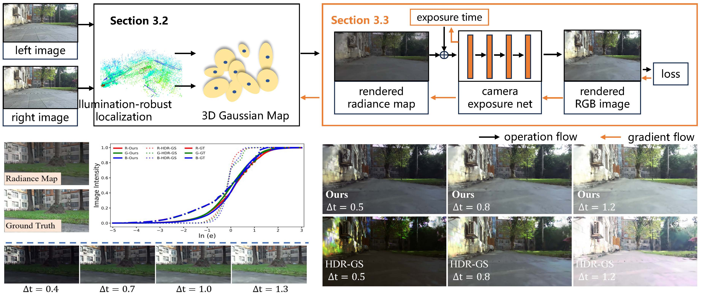

<!-- PROJECT LOGO -->

<p align="center">

  <h1 align="center">AERGS-SLAM: Auto-Exposure-Robust Stereo 3D Gaussian Splatting SLAM</h1>
<p align="center" style="font-size: 18px;">
  <a target="_blank"><strong>Zhiyu Zhou</strong></a>
  &nbsp;&nbsp;·&nbsp;&nbsp;
  <a target="_blank"><strong>Feng Hui</strong></a>
  &nbsp;&nbsp;·&nbsp;&nbsp;
  <a target="_blank"><strong>Yu Liu</strong></a>
</p>
  <h3 align="center"><a href="xx">Paper</a> | <a href="xx">Project Page</a></h3>
  <div align="center"></div>
<p align="center">
  <a href="">
    
  </a>
</p>
<p align="center">
<strong>AERGS-SLAM</strong> is a visual SLAM robust to <strong>auto-exposure</strong> variations, which achieves robust localization and high-fidelity appearance reconstruction with drastic exposure changes. Compared with the baselines, AERGS-SLAM demonstrates superior <strong>rendering quality</strong> and higher <strong>localization accuracy</strong> in challenging exposure environments.
</p>

<!-- TABLE OF CONTENTS -->
<details open="open" style='padding: 10px; border-radius:5px 30px 30px 5px; border-style: solid; border-width: 1px;'>
  <summary>Table of Contents</summary>
  <ol>
    <li>
      <a href="#getting-started">Getting Started</a>
    </li>
    <li>
      <a href="#data-preparation">Data Preparation</a>
    </li>
    <li>
      <a href="#run-demo">Run Demo</a>
    </li>
    <li>
      <a href="#run-evaluation">Run Evaluation</a>
    </li>
    <li>
      <a href="#acknowledgement">Acknowledgement</a>
    </li>
    <li>
      <a href="#citation">Citation</a>
    </li>
  </ol>
</details>

## Getting Started
1. Clone the repo with submodules
```Bash
git clone --recursive https://github.com/zzy-2021/AERGS-SLAM.git
```

2. Create a new Conda environment and then activate it. Please note that we use the CUDA 11.8 environment.


3. We rely on AirSLAM as the localization component. Please install all dependencies of AirSLAM, including `ceres`, `DBoW2`, `G2O`, `Sophus`, and `tensorrtbuffer`. 
In addition, we additionally rely on `fused-ssim`, `libtorch` (we tested the version `2.0.0+cu118`), `simple-knn`, `tinyply`, and `cv_bridge` (supporting ROS). Please download `libtorch` to the `./third_party` folder; the other dependencies are already included in it.


4. Build the dependencty——AirSLAM
```Bash
cd AirSLAM 
mkdir build && cd build
cmake .. && make -j10
cd ..
```

5. Build AERGS-SLAM
```Bash
cd AERGS-SLAM
mkdir build && cd build
cmake .. && make -j10
```


## Data Preparation
### Euroc
Download and unzip the office EuRoC dataset.

### ZedRos
You need record rosbag file in a specific path.


## Run Demo
```Bash
# 1. Run ros
roscore
cd AERGS-SLAM && rviz -d ./AirSLAM/rviz/vo.rviz      # run ros visualization at another terminal
```

```Bash
# 2. Demo for euroc dataset (example for scene V1_02_medium)
rviz -d ./AirSLAM/rviz/vo.rviz      # run ros visualization

./bin/visual_odometry_dark 
_config_path:=./configs/visual_odometry/vo_euroc.yaml
_mr_config_path:=./configs/map_refinement/mr_euroc.yaml
_dataroot:=/media/zhiyu/Seagate/Dataset/euroc/V1_02_medium/mav0
_camera_config_path:=./configs/camera/euroc.yaml
_gaussian_config_path:=./configs/gaussian_splatting/EuRoC.yaml
_model_dir:=./weight
_saving_dir:=./results/euroc_dark/V1_02_medium        # revise to yours
_voc_path:=./AirSLAM/voc/point_voc_L4.bin
_exposure_file_path:=configs/visual_odometry/ex_factors/V1_02_medium.txt
```

```Bash
# 3.1 Demo for self collected zed camera (example for scene S1)
./bin/zed_ros
_config_path:=./configs/visual_odometry/vo_zed.yaml
_mr_config_path:=./configs/map_refinement/mr_zed.yaml
_dataroot:=/media/zhiyu/Seagate/Dataset/euroc/MH_01_easy/mav0
_camera_config_path:=./configs/camera/zed.yaml
_gaussian_config_path:=./configs/gaussian_splatting/zed.yaml
_model_dir:=./weight
_saving_dir:=./results/zed/s1                          # revise to yours
_voc_path:=./AirSLAM/voc/point_voc_L4.bin
_exposure_file_path:=configs/visual_odometry/ex_factors/MH_01_easy.txt
# this will wait for the playing of a rosbag

# 3.2 play the rosbag at another terminal
cd YourRosbagPath
rosbag play s1.bag
```


## Run Evaluation
### EuRoC dataset
The PSNR and SSIM metrics will calculate automatically after runing the demo of EuRoC dataset.
```bash
cd AERGS-SLAM

# LPIPS metric
python ./evaluate/LPIPS_eval.py ./results/euroc_dark/V1_02_medium

# camera response function
python ./evaluate/LPIPS_eval.py

# camera trajectory
python ./evaluate/trajectory_eval.py
```

### Zed dataset
```bash
# PSNR and SSIM metric
./bin/zed_evaluate 
_reloc_config_path:=./configs/relocalization/reloc_zed.yaml
_gs_config_path:=./configs/gaussian_splatting/zed.yaml
_model_dir:=./weight
_camera_config_path:=./configs/camera/zed.yaml
_saving_dir:=./results/zed/s1     # revise to yours

# play the rosbag at another terminal
cd YourRosbagPath
rosbag play s1.bag


# LPIPS metric
python ./evaluate/zed_data_evaluate/LPIPS_eval_zed.py ./results/zed/s1

# trajectory metric
python ./evaluate/zed_data_evaluate/trajectory_eval_zed.py
```


## Acknowledgement
We build this project based on [Photo-SLAM](https://github.com/HuajianUP/Photo-SLAM), [AirSLAM](https://github.com/sair-lab/AirSLAM), [DROID-SLAM](https://github.com/princeton-vl/DROID-SLAM) and [3DGS](https://github.com/graphdeco-inria/gaussian-splatting). We thank the authors for their great works and hope this open-source code can be useful for your research. 

## Citation
Our paper is available on [arXiv](xx). If you find this code useful in your research, please cite our paper.
```
@inproceedings{AERGS-SLAM,
  title={AERGS-SLAM: Auto-Exposure-Robust Stereo 3D Gaussian Splatting SLAM},
  author={Zhou, Zhiyu and Hui, Feng and Liu, Yu},
  booktitle={Proceedings of the IEEE/CVF Conference on Computer Vision and Pattern Recongnition},
  year={2026}
}
```
